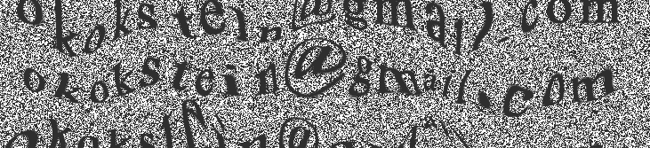

My name is Otto Kokstein, and I am a student in the Czech Republic with the goal of studying nuclear engineering in the future.

My areas of interest include programming, software developent, 3D modelling and 3D printing.

I started learning Python in 2022 and since then, I have also picked up Java and some basic Rust.

Since 2020, I have been working on the [Czech localization of Enderal: Forgotten Stories](enderal-localization-en.md) which I plan to finish in Q2 2025.

I also have a Youtube channel where I post videos about my projects.

Links:

[Youtube](https://www.youtube.com/@ottokokstein/videos)

[Github](https://github.com/ottokokstein)

## Contact

Feel free to contact me on my email address:

