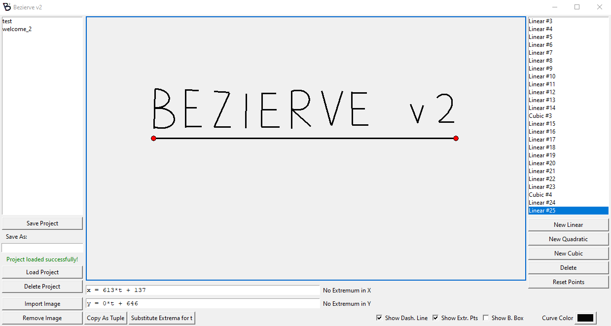

[Bezierve](https://github.com/ottokokstein/bezierve-v2) is a tool for extracting information about a Bézier curve from an image, such as its corresponding formulae, positions of extremum points and more.

## Development

I developed the program in Python's library [Tkinter](https://docs.python.org/3/library/tkinter.html) in 2023. Upon releasing version 1.0, I posted a video about Bezierve on my [YouTube channel](https://www.youtube.com/@ottokokstein). Since then, I have developed version 2.0 which fixes many issues I had with version 1.0 and also adds new features.

## Version 1.0

To get an image of what Bezierve's premise is and what features it offers, you can watch the [YouTube video](https://www.youtube.com/watch?v=HN47iyTLCG8) I made about it.

<iframe width="600" height="450"
    src="https://www.youtube.com/embed/HN47iyTLCG8">
</iframe>

## New with version 2.0

- Cleaner UI
- Option to add more than one Bézier curve (both linear and cubic, as they exist in the same space now)
- Option to save the current configuration of curves as a savefile and load it later
- Option to change curve's color
- Option to show the curve's bounding box (technically known as its axis-aligned [minimum bounding rectangle](https://en.wikipedia.org/wiki/Minimum_bounding_rectangle))
- Formulae no longer produce horizontally flipped curves when used outside Bezierve, an issue present in version 1.0
- Completely restructured code to follow a proper [OOP](https://en.wikipedia.org/wiki/Object-oriented_programming) design.

You can see the version 2.0's new UI here:

<small>Created on March 20th, 2025</small>
  
