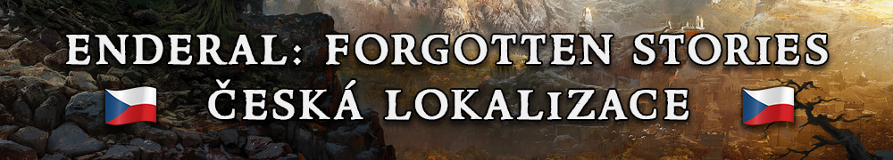
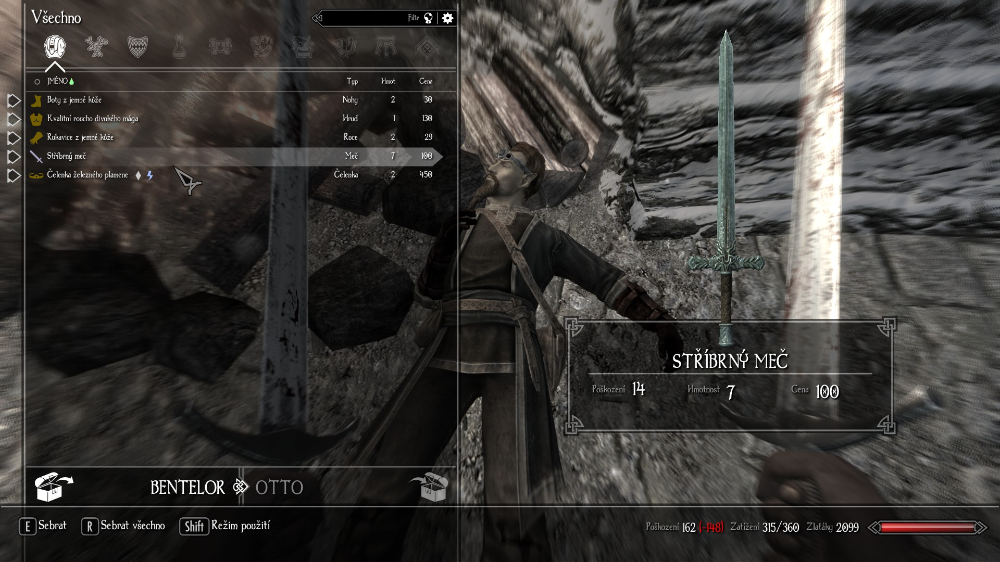

  

<small>(The English version of this article can be found [here](enderal-localization-en.md).)</small>

[Enderal: Forgotten Stories](https://store.steampowered.com/app/933480/Enderal_Forgotten_Stories/) (česky Enderal: Zapomenuté příběhy), dříve známý jako Enderal: Shards of Order (česky Enderal: Střípky Řádu), je mod hry [Skyrim](https://store.steampowered.com/app/72850/The_Elder_Scrolls_V_Skyrim/), často považovaný za vlastní, samostatnou hru díky svému nevídanému rozměru a kvalitě. Od roku 2020 lokalizuji[^1] Enderal do češtiny.

## Obsah

### Co bude lokalizováno

Každý text ve hře, tedy například:

- názvy předmětů, kouzel, lokací, úkolů a postav,
- dialogy (v podobě titulků),
- většina knih,
- texty v texturách,
- nabídky a nastavení,
- videosekvence (v podobě titulků),
- systémové zprávy.

### Co nebude lokalizováno

- Spouštěč, tj. anglicky launcher (lokalizace není podporována),
- audio,
- knižní série „The Butcher of Ark“ (česky Arkský řezník).

## Motivace

Už od chvíle, kdy jsem poprvé hrál Enderal a zjistil, že mu chybí česká lokalizace, věděl jsem, že je to něco, co bych chtěl uskutečnit. Mou hlavní motivací je zpřístupnit příběh, prostředí i všechny ostatní prvky Enderalu lidem, kteří neovládají angličtinu nebo jednoduše preferují češtinu.

## Proces lokalizace

Herní textové řetězce lokalizuji v programu [xTranslator](https://www.nexusmods.com/skyrimspecialedition/mods/134) a textury upravuji v programu [Photopea](https://www.photopea.com). Herní videosekvence jsem lokalizoval „zapečením“ titulků do videa. O tomto „zapečení“ jsem napsal [anglický návod](subtitles.md), ve kterém popisuji přesný postup, jejž jsem při lokalizaci videosekvencí použil.

Více informací o procesu lokalizace najdete na stránce [Enderal:Localization](https://en.wiki.sureai.net/Enderal:Localization).

## Stažení

Jakmile bude lokalizace hotová, stane se dostupnou na platformě Steam, stejně jako kterákoli jiná oficiální herní lokalizace. Rovněž nahraji lokalizované herní soubory sem na svou stránku spolu s návodem, jak lokalizaci manuálně implementovat v herních souborech.

## Ukázka

### Video ukázka

<iframe style="width: 35vw; height: 20vw;"
    src="https://www.youtube.com/embed/WR9Hxv33W0k?cc_load_policy=0" allowfullscreen>
</iframe>

### Galerie

 

[^1]: lokalizace = překlad a přizpůsobení hry danému jazyku tak, aby byl překlad pro hráče přirozený a odpovídal místním zvyklostem a kultuře (lokalizace tedy zahrnuje například převádění jednotek, jako jsou stopy, na metry atd.)

 
<small>Vytvořeno 20.3.2025</small>
  
