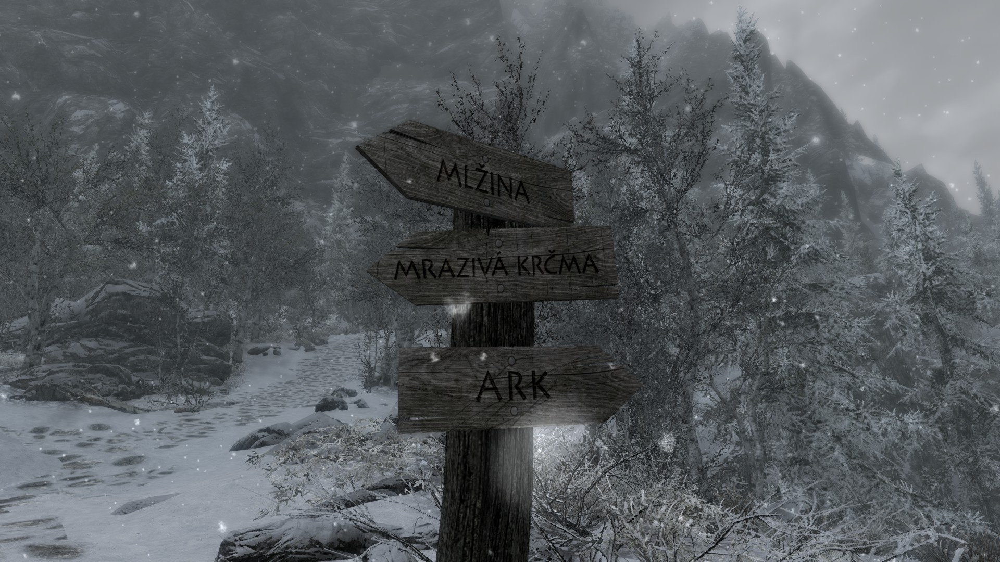
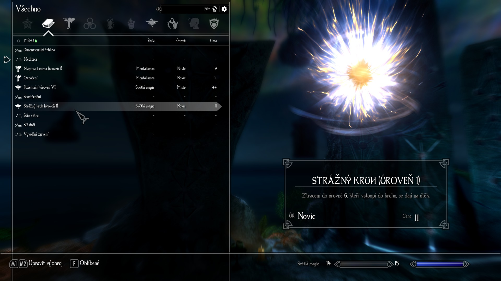

  

<small>(The English version of this article can be found [here](enderal-localization-en.md).)</small>

[Enderal: Forgotten Stories](https://store.steampowered.com/app/933480/Enderal_Forgotten_Stories/), dříve známý jako Enderal: Shards of Order, je mod pro hru [Skyrim](https://store.steampowered.com/app/72850/The_Elder_Scrolls_V_Skyrim/), často považovaný za vlastní, samostatnou hru díky svému nevídanému rozměru a kvalitě. Mezi roky 2020 a 2025 jsem lokalizoval[^1] Enderal do češtiny, a to jak klasický Enderal, tak fanouškovský port Enderalu pro Skyrim Special Edition.

## Obsah

### Co je lokalizováno

Téměř každý text ve hře, tedy například:

- názvy předmětů, kouzel, lokací, úkolů a postav,
- dialogy (v podobě titulků),
- většina knih,
- texty v texturách,
- nabídky a nastavení,
- videosekvence (v podobě titulků),
- systémové zprávy.

### Co není lokalizováno

- Launcher,
- audio,
- knižní série „The Butcher of Ark“ (česky Arkský řezník).

Poznámka: Pokud se rozhodnete hrát za ženskou postavu, hra vás bude stále oslovovat v mužském rodě, protože jsem dosud nenašel způsob, jak mít pro mužské a ženské hlavní postavy odlišné sady textů.

## Motivace

Už od chvíle, kdy jsem poprvé hrál Enderal a zjistil, že mu chybí česká lokalizace, věděl jsem, že je to něco, co bych chtěl uskutečnit. Mou hlavní motivací je zpřístupnit příběh, prostředí i všechny ostatní prvky Enderalu lidem, kteří neovládají angličtinu nebo jednoduše preferují češtinu.

## Proces lokalizace

Herní textové řetězce jsem lokalizoval v programu [xTranslator](https://www.nexusmods.com/skyrimspecialedition/mods/134) a textury upravil v programu [Photopea](https://www.photopea.com). Herní videosekvence jsem lokalizoval „zapečením“ titulků do videa. O tomto „zapečení“ jsem napsal [anglický návod](subtitles.md), ve kterém popisuji přesný postup, jejž jsem při lokalizaci videosekvencí použil.

Více informací o procesu lokalizace najdete na stránce [Enderal:Localization](https://en.wiki.sureai.net/Enderal:Localization).

## Stažení

Lokalizaci lze stáhnout na Nexus Mods, kam jsem ji se souhlasem vývojářů nahrál. Nexus Mods je zároveň ideální pro nahlašování chyb a potíží, proto tam neváhejte napsat, pokud narazíte na nějaký problém.

Lokalizace pro klasický Enderal (Classic Edition): [https://www.nexusmods.com/enderal/mods/327](https://www.nexusmods.com/enderal/mods/327)

Lokalizace pro Enderal SE (Special Edition): [https://www.nexusmods.com/enderalspecialedition/mods/996](https://www.nexusmods.com/enderalspecialedition/mods/996)

Zároveň jsem v kontaktu s vývojáři, kteří podotkli, že oficiální vydání lokalizace na Steamu sice není pravděpodobné, ale zcela ho nevyloučili.

## Ukázka

### Video ukázka

<iframe style="width: 35vw; height: 20vw;"
    src="https://www.youtube.com/watch?v=wiIeZoUC5zA?cc_load_policy=0" allowfullscreen>
</iframe>

### Galerie

 

[^1]: lokalizace = překlad a přizpůsobení hry danému jazyku tak, aby byl překlad pro hráče přirozený a odpovídal místním zvyklostem a kultuře (lokalizace tedy kromě samotného překladu zahrnuje například také převádění jednotek, užívání slangu a hovorového jazyka ve vhodných situacích, překlad názvů míst a postav atd.)

 
<small>Vytvořeno 20.3.2025</small>
<small>Naposledy aktualizováno 9.11.2025</small>
  
