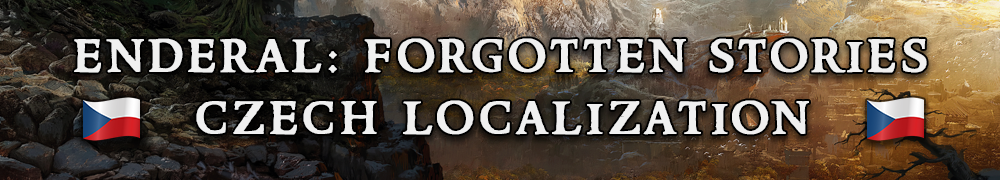

  

(Pro českou verzi textu viz článek <a href="enderal-localization-cz.md" style="color: inherit;">Česká lokalizace modu Enderal</a>.)

<a href="https://store.steampowered.com/app/933480/Enderal_Forgotten_Stories/" style="color: inherit;">Enderal: Forgotten Stories</a> is a <a href="https://store.steampowered.com/app/72850/The_Elder_Scrolls_V_Skyrim/" style="color: inherit;">Skyrim</a> modification often considered a stand-alone game due to its sheer quality and scale. Since 2020, I have been localizing (translating) it into Czech.

## Motivation

Ever since first playing Enderal and discovering that it was missing a Czech localization, I knew it was something I wanted to pursue. My main motivation is to allow Czech players to enjoy its lore, story and ambience without any language barriers.

## XYZ

(The work around localization has motivated me to learn Python and RegEx, both of which I use on a regular basis now.)

## Process

The localization is done in a program called 
