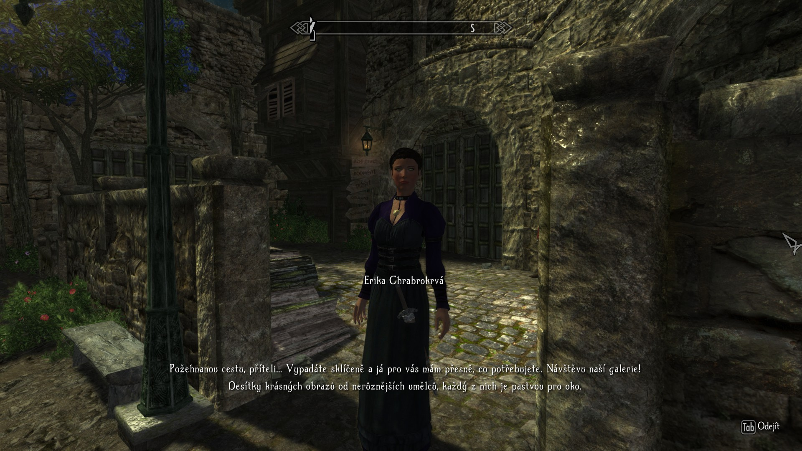
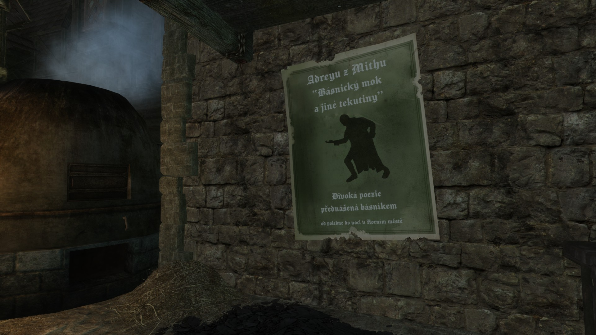

  

<small>(Pro českou verzi textu viz článek [Česká lokalizace modu Enderal](enderal-localization-cz.md).)</small>

[Enderal: Forgotten Stories](https://store.steampowered.com/app/933480/Enderal_Forgotten_Stories/) (formerly Enderal: Shards of Order) is a [Skyrim](https://store.steampowered.com/app/72850/The_Elder_Scrolls_V_Skyrim/) modification often considered a stand-alone game due to its sheer quality and scale. Since 2020, I have been localizing[^1] it into Czech.

## Content

### What will be localized

Almost every in-game text, for example:

- Names of items, spells, locations, quests and NPCs
- Dialogues (in the form of subtitles)
- Quest objectives and journal entries
- Most books
- Texts in textures
- Menus and settings
- Cinematics (in the form of subtitles)
- System messages

### What won't be localized

- Game launcher (localization not supported)
- Audio
- "The Butcher of Ark" book series

Note: If you choose to play as a female character, the game will still address you as male, as I have not yet found a way to provide separate strings for male and female protagonists.

## Motivation

Ever since first playing Enderal and discovering that it was missing a Czech localization, I knew it was something I wanted to pursue. My main motivation was to allow Czech players to enjoy its lore, story and ambience without any language barriers.

## Process

Strings (in-game texts) are localized in [xTranslator](https://www.nexusmods.com/skyrimspecialedition/mods/134) and textures are edited in [Photopea](https://www.photopea.com). Enderal's cinematics were localized by burning subtitles into them (I have posted a [guide](subtitles.md) detailing the exact process I used, if you are interested).

More info about the process of localization itself can be found [here](https://en.wiki.sureai.net/Enderal:Localization).

## Download

As of 2025, the localization is complete. The only remaining step is for the SureAI developers to publish it on Steam as an official localization, which they have noted may take some time. With their approval, I have decided to release the files on Nexus Mods in the meantime. You can find them [here](https://www.nexusmods.com/enderal/mods/327), along with an installation guide. If you run into any issues, don't hesitate to [contact me](about-me.md).

## Showcase

### Video Showcase

<iframe style="width: 35vw; height: 20vw;"
    src="https://www.youtube.com/embed/WR9Hxv33W0k?cc_load_policy=0" allowfullscreen>
</iframe>

### Gallery

 

[^1]: localization = translation and adaptation of a game to a specific language so that the translation feels natural to players and aligns with local customs and culture (localization includes, for example, converting units like feet to meters, etc.)

 
<small>Created on March 20th, 2025</small>
  
