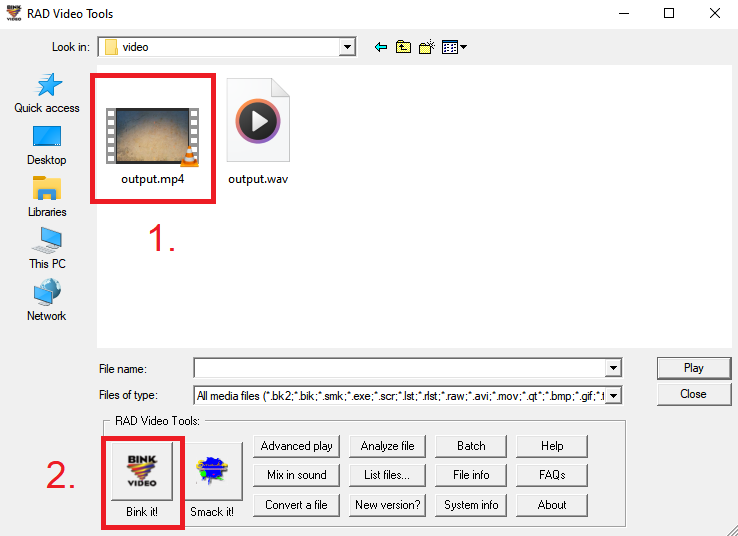
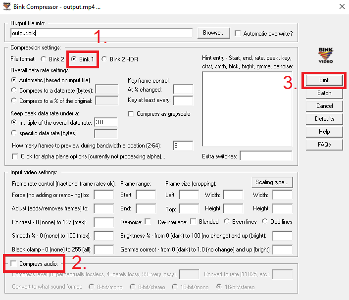

# Burning subtitles into a Bink Video File (.bik)

While working on the [Czech localization of Enderal: Forgotten Stories](enderal-localization.md), I needed to burn subtitles into a `.bik` video. Upon realizing there isn't a guide on how to do this on the Internet yet, I decided to write this article. Note that there may be other, simpler methods. Also, this guide is for Windows users; however, with some adjustments, it should still be possible on other operating systems.

## Goal

### Input files

1. `.bik` video file
2. `.srt` or `.txt` subtitle file

### Output file

1. `.bik` video file with subtitles burned into it

## Required programs

1. FFmpeg (Install via [this article](https://www.hostinger.com/tutorials/how-to-install-ffmpeg), tested version **2023-05-31**)
2. Optional: VLC Media Player (Download [here](https://www.videolan.org/vlc/), tested version **3.0.18**)
3. RAD Video Tools (Download [here](https://www.radgametools.com/bnkdown.htm) - Mind the password, tested version **2025.01**)

## Process Overview

1. <a href="#1-convert-bik-to-mp4-using-ffmpeg" style="color: inherit;">Convert <code style="color: inherit;">.bik</code> to <code style="color: inherit;">.mp4</code> using FFmpeg</a>
2. <a href="#2-generate-wav-from-mp4-using-ffmpeg" style="color: inherit;">Generate <code style="color: inherit;">.wav</code> from <code style="color: inherit;">.mp4</code> using FFmpeg</a>
3. <a href="#3-convert-srt-or-txt-to-ass-using-ffmpeg" style="color: inherit;">Convert <code style="color: inherit;">.srt</code> or <code style="color: inherit;">.txt</code> to <code style="color: inherit;">.ass</code> using FFmpeg</a>
4. <a href="#4-optional-configure-ass-formatting" style="color: inherit;">Optional: Configure <code style="color: inherit;">.ass</code> formatting</a>
5. <a href="#5-burn-ass-into-mp4-using-ffmpeg" style="color: inherit;">Burn <code style="color: inherit;">.ass</code> into <code style="color: inherit;">.mp4</code> using FFmpeg</a>
6. <a href="#6-convert-mp4-to-bik-using-rad-video-tools-with-sound-compression-turned-off" style="color: inherit;">Convert <code style="color: inherit;">.mp4</code> to <code style="color: inherit;">.bik</code> using Rad Video Tools (with sound compression turned off)</a>
7. <a href="#7-add-sound-from-wav-to-bik-using-rad-video-tools" style="color: inherit;">Add sound from <code style="color: inherit;">.wav</code> to <code style="color: inherit;">.bik</code> using Rad Video Tools</a>

## Detailed Guide

### 0. Prepare files

To make the process easier, put both the initial `.bik` video file and the `.srt` or `.txt` subtitle file in one folder together.

### 1. Convert `.bik` to `.mp4` using FFmpeg

To convert a Bink Video File (`.bik`) to `.mp4`, we will use FFmpeg. First, open the Command Prompt and navigate to the directory where your input files are located using the `cd` command. For example:

`cd "C:\Program Files\"` (or `D:` and then `cd "D:\Program Files\"` if navigating to a different drive)

You can then convert the `.bik` video file using:

`ffmpeg -i "input.bik" -c:v libx264 -preset fast -crf 23 -c:a aac`

(replace `input.bik` with the name of your `.bik` file)

Setting the `crf` value (default = 23) lower will make the output `.mp4` video higher quality at the expense of its size (0 = lossless but largest file size).

### 2. Generate `.wav` from `.mp4` using FFmpeg

You will also need a `.wav` sound file for later. You can generate it from the `.mp4` you just created using:

`ffmpeg -i "input.mp4" -acodec pcm_s16le -ar 44100 -ac 2 "output.wav"`

(replace `input.mp4` with the name of your `.mp4` file)

### 3. Convert `.srt` or `.txt` to `.ass` using FFmpeg

Next, you will need to convert your subtitle file to an `.ass` file. Note that this subtitle file should already be filled and in accordance with the [SubRip file format](https://en.wikipedia.org/wiki/SubRip#Format).

For an `.srt` file, the command will be `ffmpeg -i "input.srt" "output.ass"`

(replace `input.srt` with the name of your `.srt` file)

For an `.txt` file, the command will be `ffmpeg -i "input.txt" "output.ass"`

(replace `input.txt` with the name of your `.txt` file)

### 4. Optional: Configure `.ass` formatting

The `.ass` subtitle format supports a wide range of customization. You can edit the subtitles directly in Notepad and preview them in the VLC Media Player.

### 5. Burn `.ass` into `.mp4` using FFmpeg

If your `.ass` subtitles are ready to be burned into your video, you can do so using this command:

`ffmpeg -i "input.mp4" -vf "ass=output.ass" "output.mp4"`

(replace `input.mp4` with the name of your `.mp4` file)

Note that this step may take up to several minutes.

### 6. Convert `.mp4` to `.bik` using Rad Video Tools (with sound compression turned off)

After you extract the `.7z` file using the password and installing Rad Video Tools, open it and navigate to your directory inside the program. Then, select `output.mp4` and press `Bink it!`, as shown in the image below:

In the new window, make sure that the `Bink 1` file format (AKA `.bik`) is selected and that the `Compress audio` checkbox is **unchecked** (When left checked, the generated `.bik` file will have just static noise instead of the original audio, not sure why this is). After that, press `Bink`, as shown in the image below:

Note that this step may take up to several tens of minutes or even hours if the video is especially long (> 10 min).

After the compression is finished, close all RAD Video Tools windows.

### 7. Add sound from `.wav` to `.bik` using Rad Video Tools

Now, open RAD Video Tools once again and navigate to your directory inside the program. Here, select the newly generated `output.bik` and click `Mix in sound`, as shown in the image below:

In the new window, click `Browse`, navigate to your directory and select `output.wav`. After that, press `Mix`, as shown in the image below:

After the sound mixing finishes, close all RAD Video Tools windows.

### Conclusion

You should now be left with a file called `New_output.bik` in your directory. RAD Video Tools also provides a Bink Video File player, so you can check if the process was successful.

 
<small>Created on March 8th, 2025</small>
