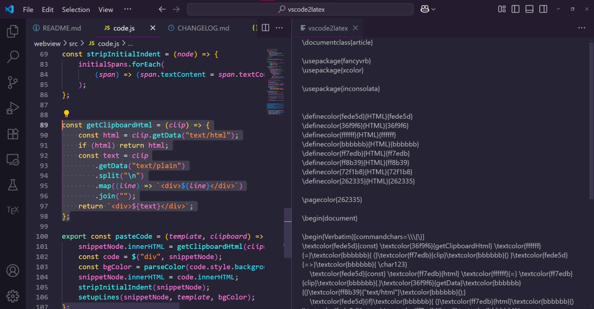

  

[vscode2latex](https://github.com/ottokokstein/vscode2latex) is a VS Code extension that converts selected code into a LaTeX file, preserving VS Code’s syntax highlighting and colors using a default or custom template. You can find it on the VS Code Marketplace.

## Development

The initial version of this extension relied on a Python script running externally on the client’s device, requiring the installation of several non-standard libraries. To improve usability and remove these dependencies, I sought a solution that did not rely on Python.

Although my experience with JavaScript was limited and no straightforward approach was apparent, I discovered the [CodeSnap extension](https://github.com/kufii/CodeSnap), which offers similar functionality. Leveraging its codebase enabled the development of version 2.0, which runs purely on JS.

Special thanks to the author(s) of CodeSnap for their invaluable contribution.

## Use

- Download the extension from the VS Code Marketplace
- Select code that is syntax-highlighted
- Open the Command Palette (default shortcut: F1)
- Run the `vscode2latex: Convert Code to LaTeX` command
- Copy the generated LaTeX code from the sidebar

### Template

By default, the extension uses this [.tex template](https://github.com/ottokokstein/vscode2latex/blob/master/template.tex). You can use your own custom template by setting the `vscode2latex.templateFilepath` setting to your custom filepath. Be sure to include these placeholders:
- `VERBATIM_PLACEHOLDER`: The formatted code with `\textcolor` commands will be inserted here.
- `DEFINITIONS_PLACEHOLDER`: The color definitions with `\definecolor` commands will be inserted here.
- `BG_COLOR_PLACEHOLDER`: The background color’s hex code (without #) will be inserted here.

## Changelog

Updates to this extension are documented in a changelog which can be found [here](https://github.com/ottokokstein/vscode2latex/blob/master/CHANGELOG.md).

## Showcase

<small>Created on June 30th, 2025</small>
  
